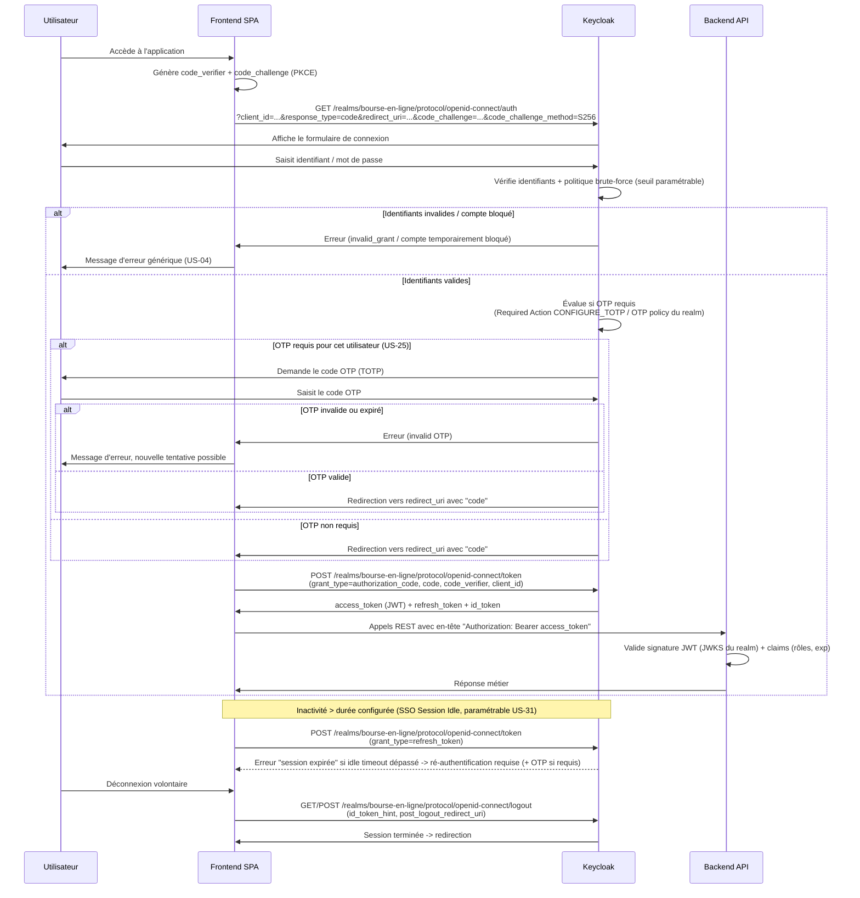
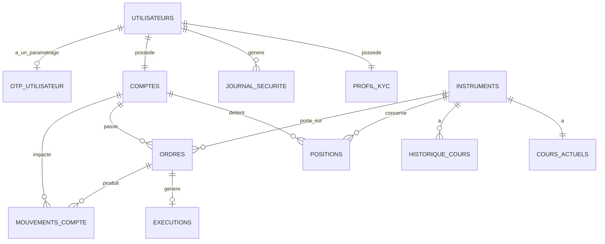

# Architecture technique — MVP Plateforme de Bourse en Ligne

> Document produit par l'architecte, sur la base de la spécification fonctionnelle (`docs/specs.md`).
> Stack strictement limitée à **Keycloak**, **PostgreSQL** et **Apache Kafka**.
> Version mise à jour intégrant les exigences US-23 à US-34 (ordres à cours limité, OTP, réinitialisation de mot de passe self-service, paramétrage admin de la sécurité, devise paramétrable).

---

## 1. Vue d'ensemble de l'architecture

### 1.1 Composants

| Composant | Rôle |
|---|---|
| **Frontend Web (SPA, servi via Nginx)** | Interface investisseur / admin / support. Délègue l'authentification à Keycloak (redirection OIDC), inclut les écrans "Forgot password", "Configurer OTP" et le module d'administration (sécurité, devise, instruments). Implémenté comme un squelette **HTML/CSS/JS vanilla (ES modules, sans étape de build)**, servi par un conteneur **Nginx** (`bourse-frontend`, image `nginx:alpine`) exposé sur `http://localhost:3000` — URL correspondant au `redirectUri` du client `frontend-spa` (cf. section 2.3 et `keycloak/realm-export.json`). Fichiers sources dans `frontend/` (`index.html` = login, `callback.html` = échange du code OAuth2, `dashboard.html` = tableau de bord + module admin conditionnel). |
| **API Gateway / Backend applicatif** | Expose les APIs REST (cf. section 5), valide les jetons JWT émis par Keycloak, applique les règles métier (vérif. solde/position, horaires de marché, type d'ordre), produit/consomme les messages Kafka, lit/écrit dans PostgreSQL, et appelle l'**Admin REST API Keycloak** pour synchroniser les paramètres de sécurité/OTP. |
| **Keycloak** | Fournisseur d'identité (IdP) : authentification, gestion des comptes, rôles, sessions, politique de sécurité (tentatives échouées, expiration de session), OTP (TOTP natif), réinitialisation de mot de passe (Forgot Password / SMTP). |
| **PostgreSQL** | Persistance des données métier : utilisateurs/comptes, portefeuilles, instruments, ordres (au marché et à cours limité), transactions, historique des cours, et **schéma `administration`** pour les paramètres de sécurité/OTP/devise. |
| **Apache Kafka** | Bus d'événements temps réel : diffusion des cours de marché et du cycle de vie des ordres (création, exécution — y compris déclenchement différé des ordres à cours limité —, annulation, rejet). |
| **Service "Market Data Feed"** | Service applicatif qui produit les cours dans Kafka (et persiste l'historique en PostgreSQL). Dans le MVP, peut être un simulateur de cours sur le marché unique. |
| **Service "Order Execution Service"** | Service applicatif qui consomme les ordres créés (`orders.created`), applique les règles métier (solde, position, horaires, type d'ordre), exécute immédiatement les ordres "au marché" au meilleur prix courant, met à jour PostgreSQL et publie les événements résultants dans Kafka. Pour les ordres "à cours limité", enregistre l'ordre en attente (statut `en_attente`) sans exécution immédiate. |
| **Service "Order Matching / Limit Order Trigger Service"** *(nouveau)* | Service applicatif consommant en continu `market.prices`. Pour chaque mise à jour de cours, évalue les ordres à cours limité `en_attente` sur l'instrument concerné, et déclenche leur exécution (publication sur `orders.executed`, mise à jour PostgreSQL) lorsque le seuil de prix est atteint. Peut être un module logique du même service applicatif que `Order Execution Service`, ou un service distinct — le découpage exact relève de l'implémentation, l'architecture exige seulement la présence de ce rôle fonctionnel. |
| **Service "Notification temps réel" (interne)** | Consomme Kafka et pousse les mises à jour de statut/cours vers le frontend (ex. via un canal applicatif côté backend). *Aucune techno de notification externe (email/push) n'est introduite — hors périmètre MVP, cf. specs §6. L'envoi d'email pour "Forgot password" est géré nativement par Keycloak via SMTP, cf. section 2.6.* |
| **Module Admin (backend)** *(nouveau, fonctionnel)* | Sous-ensemble d'endpoints du backend, réservé au rôle `administrateur`, qui lit/écrit le schéma `administration` (PostgreSQL) et synchronise certains paramètres vers Keycloak via l'Admin REST API (Brute Force Detection, SSO Session Idle, Required Actions OTP). |

### 1.2 Diagramme global

```mermaid
flowchart LR
    subgraph Client
        FE[Frontend Web SPA]
    end

    subgraph IAM["Keycloak (IAM / SSO)"]
        KC[Realm "bourse-en-ligne"<br/>Clients + Rôles + Politique sécurité<br/>+ OTP (TOTP) + Forgot Password (SMTP)]
    end

    subgraph Backend["Services applicatifs"]
        API[API Gateway / Backend REST<br/>+ Module Admin]
        MDF[Market Data Feed Service]
        OES[Order Execution Service]
        LOT[Limit Order Trigger Service]
    end

    subgraph DB["PostgreSQL"]
        PG[(Base bourse_db<br/>Schémas: identite, portefeuille,<br/>marche, ordres, historique,<br/>administration)]
    end

    subgraph KFK["Apache Kafka"]
        T1[[market.prices]]
        T2[[orders.created]]
        T3[[orders.executed]]
        T4[[orders.cancelled]]
        T5[[orders.rejected]]
    end

    FE -- "1. Redirection OIDC<br/>Authorization Code + PKCE<br/>(+ OTP si requis, + Forgot Password)" --> KC
    KC -- "2. Code -> Token (JWT)" --> FE
    FE -- "3. Requêtes REST + Bearer JWT" --> API
    API -- "Validation JWT (clé publique realm)" --> KC
    API -- "4. Admin REST API<br/>(sync paramètres sécurité/OTP)" --> KC

    API -- "Lecture/écriture" --> PG
    MDF -- "Publie cours" --> T1
    MDF -- "Persiste historique cours" --> PG

    API -- "Publie ordre créé<br/>(au marché ou à cours limité)" --> T2
    OES -- "Consomme" --> T2
    OES -- "Lit dernier cours / paramètres marché" --> PG
    OES -- "Vérifie solde/position" --> PG
    OES -- "Exécute ordre au marché<br/>ou enregistre ordre limité en attente" --> PG
    OES -- "Publie résultat (ordre au marché)" --> T3
    OES -- "Publie résultat" --> T4
    OES -- "Publie résultat" --> T5

    T1 -- "Consomme cours" --> LOT
    LOT -- "Évalue ordres limités en_attente" --> PG
    LOT -- "Met à jour ordre + portefeuille" --> PG
    LOT -- "Publie déclenchement" --> T3

    T1 -- "Consomme (cours temps réel)" --> API
    T3 -- "Consomme (statut ordre)" --> API
    T4 -- "Consomme (statut ordre)" --> API
    T5 -- "Consomme (statut ordre)" --> API
    API -- "Push statut/cours" --> FE
```

### 1.3 Principes directeurs

- **Authentification centralisée** : aucun service applicatif ne gère de mot de passe ; Keycloak est l'unique source de vérité pour l'identité, les rôles, la politique de sécurité (tentatives échouées, expiration de session), l'OTP et la réinitialisation de mot de passe.
- **Découplage temps réel via Kafka** : la diffusion des cours et la propagation des changements d'état des ordres se font via des topics ; le déclenchement différé des ordres à cours limité s'appuie sur la même mécanique de consommation de `market.prices`, sans introduire de nouvelle techno (pas de scheduler externe, pas de cache).
- **PostgreSQL comme source de vérité métier** : soldes, positions, ordres (au marché et à cours limité), historique et **paramètres de configuration plateforme** (schéma `administration`) sont toujours persistés en base ; Kafka sert à la diffusion et à la communication inter-services, pas de stockage durable de référence.
- **Marché unique** : un seul jeu d'horaires d'ouverture, contrôlé à la fois côté `Order Execution Service` / `Limit Order Trigger Service` (rejet/déclenchement d'ordre) et exposé via l'API pour affichage côté frontend.
- **Paramétrage sans redéploiement** : les paramètres de sécurité, OTP et devise sont stockés en PostgreSQL (schéma `administration`) et/ou en configuration Keycloak (realm settings via Admin REST API), modifiables à chaud par un administrateur via l'API backend, sans redéploiement applicatif (US-30, US-31, US-32, US-33, US-34).

---

## 2. Authentification (Keycloak)

### 2.1 Flux OAuth2 / OIDC — Authorization Code Flow + PKCE (avec OTP optionnel)

Le frontend est une SPA : on utilise **Authorization Code Flow avec PKCE** (recommandation OAuth2 pour les clients publics). Le flow intègre désormais une étape OTP conditionnelle (Required Action `CONFIGURE_TOTP` / vérification TOTP) gérée nativement par Keycloak.



### 2.2 Endpoints Keycloak utilisés

| Endpoint | Usage |
|---|---|
| `GET /realms/bourse-en-ligne/protocol/openid-connect/auth` | Démarrage du flow Authorization Code + PKCE, affichage de la page de login Keycloak (intègre l'écran OTP si requis et le lien "Forgot password") |
| `POST /realms/bourse-en-ligne/protocol/openid-connect/token` | Échange du `code` contre les tokens (access/refresh/id) ; également utilisé pour le `refresh_token` |
| `GET /realms/bourse-en-ligne/protocol/openid-connect/userinfo` | Récupération des informations du profil utilisateur (claims standard + rôles) |
| `GET|POST /realms/bourse-en-ligne/protocol/openid-connect/logout` | Déconnexion (US "déconnexion volontaire") |
| `GET /realms/bourse-en-ligne/.well-known/openid-configuration` | Découverte de la configuration OIDC du realm (endpoints, clés JWKS) |
| `GET /realms/bourse-en-ligne/protocol/openid-connect/certs` | Récupération des clés publiques (JWKS) pour la validation des JWT côté backend |
| `GET /realms/bourse-en-ligne/login-actions/reset-credentials` | Point d'entrée du flow **"Forgot password"** (US-23), accessible depuis l'écran de login Keycloak |
| **Admin REST API Keycloak** (`/admin/realms/bourse-en-ligne/...`) | Utilisé par le **backend (Module Admin / admin-tools)** pour : lister les comptes bloqués (US-07), débloquer un compte (US-06), activer/désactiver un compte, **mettre à jour la politique Brute Force Detection et SSO Session Idle du realm (US-30, US-31)**, **gérer les Required Actions OTP par utilisateur (US-24, US-32)** |

### 2.3 Configuration Realm / Clients / Rôles

**Realm** : `bourse-en-ligne`

**Clients Keycloak** :

| Client ID | Type | Usage |
|---|---|---|
| `frontend-spa` | Public, PKCE obligatoire (`S256`) | Application web utilisée par tous les profils (investisseur, admin, support) ; le rôle détermine l'UI affichée |
| `backend-api` | Confidentiel (bearer-only / resource server) | Valide les JWT émis par `frontend-spa`, n'initie pas de login lui-même |
| `admin-tools` | Confidentiel, service account | Utilisé par le backend (Module Admin) pour appeler l'**Admin REST API** Keycloak (déblocage de compte, gestion des comptes, **mise à jour de la politique brute-force, de la durée de session, et des Required Actions OTP**) avec le rôle `realm-management` adéquat (`manage-realm`, `manage-users`) |

**Rôles realm** (mappés aux 3 rôles métier de `docs/specs.md`) :

| Rôle Keycloak | Correspondance métier | Périmètre |
|---|---|---|
| `investisseur` | Investisseur particulier | Accès à son propre portefeuille, ses ordres (au marché et à cours limité), son historique, ses paramètres OTP personnels |
| `administrateur` | Administrateur | Gestion des comptes, du référentiel d'instruments, supervision globale des ordres, configuration des paramètres de sécurité/OTP/devise |
| `support_client` | Support client | Lecture seule sur comptes/portefeuilles/historiques, déblocage de compte |

Les rôles sont inclus dans le `access_token` (claim `realm_access.roles`) et utilisés par le backend pour l'autorisation (RBAC) sur chaque endpoint.

### 2.4 Traduction des seuils de sécurité en configuration Keycloak

| Exigence métier (specs §0, §5, §2.6) | Configuration Keycloak |
|---|---|
| **N tentatives échouées avant blocage temporaire (paramétrable, défaut 5)** | Realm Settings → **Security Defenses → Brute Force Detection** : `bruteForceProtected = true`, `maxLoginFailures = N`. Le compte passe en `user_temporarily_disabled` à la Nème tentative. Valeur synchronisée depuis `administration.parametres_securite` (cf. section 2.6). |
| **Réinitialisation du compteur après connexion réussie ou réinitialisation de mot de passe réussie** | Comportement natif de Brute Force Detection : un login réussi ou un changement de mot de passe réinitialise le compteur d'échecs (`failureResetTimeSeconds`). |
| **Déblocage automatique après expiration du délai** | Paramètres `waitIncrementSeconds` et `maxFailureWaitSeconds` définissent la durée du blocage temporaire (valeur précise à confirmer — point ouvert §7.4 des specs, ex. 15 min). |
| **Déblocage manuel par support/admin (US-06)** | Le backend (avec le client `admin-tools` et le rôle `manage-users`) appelle l'Admin REST API Keycloak pour réinitialiser l'état `enabled`/`temporarily disabled` de l'utilisateur ciblé. |
| **Liste des comptes bloqués (US-07)** | Le backend interroge l'Admin REST API Keycloak (ou un export périodique) pour identifier les utilisateurs en état `temporarily disabled` ; ces informations peuvent être exposées via un endpoint admin dédié (cf. section 5). |
| **Durée d'expiration de session par inactivité (paramétrable, défaut 30 min, US-31)** | Realm Settings → **Sessions → SSO Session Idle = N minutes**. Keycloak applique un délai technique supplémentaire (~2 min) avant invalidation effective. Valeur synchronisée depuis `administration.parametres_securite`. |
| **Maintien de session si activité (US-05 critère 2)** | Comportement natif : chaque rafraîchissement de token (`refresh_token`) ou interaction avec Keycloak réinitialise le compteur `SSO Session Idle`. |
| **Message générique en cas d'échec (US-04)** | Configuration du thème de login Keycloak : message d'erreur générique ne distinguant pas identifiant/mot de passe invalide. |
| **Information sur tentatives restantes (US-04)** | Non natif à Keycloak — peut être approché côté frontend en affichant un message générique de prudence après chaque échec ; un compteur précis nécessiterait une extension (SPI Keycloak), à valider avec l'utilisateur si requis. |

> Remarque : la **durée précise du blocage** et l'**activation/désactivation initiale du compte** (KYC automatique) sont gérées via l'attribut `enabled` de l'utilisateur Keycloak, positionné par le backend lors de l'inscription (US-01/US-02) après contrôle KYC simplifié exécuté côté backend/PostgreSQL.

### 2.5 Inscription et KYC simplifié

L'inscription (US-01/US-02) est gérée par le **backend** (et non directement par le formulaire de registration Keycloak), afin de pouvoir :
1. Collecter les informations KYC (identité, coordonnées, justificatifs déclaratifs) et les persister dans PostgreSQL (table `identite.profil_kyc`).
2. Exécuter les contrôles automatiques (complétude, format, cohérence).
3. Si validé : créer l'utilisateur dans Keycloak via l'**Admin REST API** (`POST /admin/realms/bourse-en-ligne/users`), lui assigner le rôle `investisseur`, et le marquer `enabled = true`.
4. Créer en parallèle l'enregistrement `comptes` / `portefeuilles` correspondant en PostgreSQL, avec la **devise par défaut courante de la plateforme** (cf. section 3.7).

### 2.6 Réinitialisation de mot de passe self-service (US-23)

Le flow "mot de passe oublié" est géré **nativement par Keycloak**, sans introduction de nouvelle techno :

- Sur l'écran de login Keycloak, un lien **"Forgot Password?"** déclenche le flow `reset-credentials` (Required Action `UPDATE_PASSWORD`).
- L'investisseur saisit son identifiant/email ; Keycloak envoie un email contenant un lien de réinitialisation à durée de vie limitée et à usage unique (Required Action `UPDATE_PASSWORD` exécutée une seule fois).
- Une fois le nouveau mot de passe défini et conforme à la politique de mot de passe du realm (Password Policy), Keycloak réinitialise également le compteur Brute Force Detection associé au compte (comportement natif).

**Dépendance de configuration Keycloak (et non nouvelle techno applicative)** :
- Le realm `bourse-en-ligne` doit avoir une **configuration SMTP** renseignée (Realm Settings → Email : host, port, from, authentification). Ceci est une **dépendance de configuration de l'instance Keycloak existante** (paramétrage d'un realm setting), pas l'ajout d'un nouveau composant d'infrastructure. Le choix du serveur SMTP utilisé (fournisseur, identifiants) reste un point ouvert (cf. section 7).
- Le realm doit avoir l'option **"Forgot password"** activée (Realm Settings → Login → `resetPasswordAllowed = true`).

**Endpoints/flow concernés** :
- `GET /realms/bourse-en-ligne/login-actions/reset-credentials` — point d'entrée du flow, depuis l'écran de login.
- Email envoyé par Keycloak (via SMTP configuré) contenant un lien vers `login-actions/action-token?...` qui déclenche la Required Action `UPDATE_PASSWORD`.
- Aucun endpoint backend dédié n'est nécessaire : le flow est entièrement pris en charge par Keycloak, le backend n'intervient pas dans la réinitialisation elle-même.

### 2.7 Authentification à deux facteurs — OTP (US-24, US-25, US-32, US-33)

#### 2.7.1 Flow OTP natif Keycloak

- Keycloak fournit nativement le second facteur **OTP/TOTP** via la Required Action **`CONFIGURE_TOTP`** ("Configure OTP") : lorsqu'elle est assignée à un utilisateur (ou imposée par la politique du realm), l'utilisateur doit scanner un QR code (application TOTP type Google Authenticator) lors de sa prochaine connexion, puis saisir un code OTP à chaque connexion suivante (selon la politique OTP du realm, Authentication → OTP Policy).
- La vérification OTP s'insère dans le flow d'authentification du browser (cf. diagramme section 2.1), entre la validation du mot de passe et la délivrance du `code` d'autorisation.
- L'activation/désactivation de l'OTP **par l'investisseur lui-même** (US-24) correspond, côté Keycloak, à l'ajout/suppression de la credential `OTP` sur son compte — réalisable via la console "Account Management" de Keycloak (`/realms/bourse-en-ligne/account`) ou via un appel backend à l'Admin REST API (suppression de la credential `otp` de l'utilisateur), **sous réserve que l'OTP ne soit pas imposé globalement par l'administrateur** (cf. ci-dessous).

#### 2.7.2 Paramétrage administrateur de l'OTP (US-32, US-33) — approche retenue

Deux approches étaient possibles :

- **Option A — 100% Keycloak** : utiliser uniquement les Required Actions et la politique du realm (Required Action `CONFIGURE_TOTP` marquée "par défaut" pour activer l'OTP globalement, ou assignée individuellement via l'Admin REST API pour un utilisateur donné). Limite : Keycloak ne propose pas nativement de **règle de fréquence** ("après N jours" / "après N connexions") — l'OTP est soit demandé à chaque connexion (si la credential OTP existe), soit jamais.
- **Option B retenue — Table de configuration PostgreSQL + logique backend** : le schéma `administration` (cf. section 3.7) stocke :
  - un indicateur d'activation globale de l'OTP (`otp_actif_global`),
  - la règle de fréquence (`otp_frequence_type` : `chaque_connexion` / `apres_n_jours` / `apres_n_connexions`, et `otp_frequence_valeur`),
  - et, par utilisateur, une table `administration.otp_utilisateur` (`utilisateur_id`, `otp_active` (bool, override individuel), `date_derniere_verif_otp`, `nb_connexions_depuis_derniere_verif`).

  Le **backend**, lors de chaque tentative de connexion (ou juste avant de finaliser le flow OIDC), évalue ces règles pour décider si la Required Action `CONFIGURE_TOTP`/vérification OTP doit être **imposée pour cette session** via l'Admin REST API (ajout dynamique de la Required Action `CONFIGURE_TOTP` sur l'utilisateur avant la redirection vers `/auth`, ou retrait si la fréquence ne l'exige pas pour cette connexion).

**Compromis explicité** :
- Option A est plus simple (zéro logique applicative, tout natif Keycloak) mais ne couvre pas la règle de fréquence "après N jours / après N connexions" exigée par US-33.
- Option B (retenue) introduit une logique métier côté backend et une dépendance à PostgreSQL pour le pilotage fin de l'OTP, mais reste strictement dans la stack imposée (pas de nouvelle techno) et répond complètement à US-32/US-33. Le coût est une orchestration supplémentaire entre le backend et l'Admin REST API Keycloak à chaque login (latence additionnelle modérée, acceptable pour un MVP).
- L'activation/désactivation **individuelle** par l'investisseur (US-24) reste possible tant que `otp_actif_global = false` ou que l'utilisateur ne fait pas partie du périmètre imposé : le backend vérifie `administration.otp_utilisateur.otp_active` avant d'autoriser la désactivation côté Keycloak.

#### 2.7.3 Impact sur le diagramme de séquence d'authentification

Le diagramme de séquence section 2.1 intègre déjà l'étape OTP conditionnelle. Avec l'approche retenue (Option B), l'étape *"KC évalue si OTP requis"* est en réalité précédée d'un appel backend → Admin REST API Keycloak (non représenté dans le diagramme pour rester lisible) qui positionne ou retire dynamiquement la Required Action `CONFIGURE_TOTP` sur l'utilisateur, en fonction de `administration.parametres_securite` / `administration.otp_utilisateur`, avant que le navigateur n'atteigne l'écran de login Keycloak.

---

## 3. Base de données (PostgreSQL)

Base unique `bourse_db`, organisée par schémas fonctionnels.

### 3.1 Schéma `identite`

| Table | Rôle | Champs clés (description) |
|---|---|---|
| `utilisateurs` | Référence locale de l'utilisateur, miroir de l'identité Keycloak | `id` (UUID, PK), `keycloak_user_id` (UUID, unique — référence vers le sub Keycloak), `email`, `nom`, `prenom`, `date_creation`, `statut` (actif / bloqué / désactivé) |
| `profil_kyc` | Informations déclaratives collectées à l'inscription | `id` (PK), `utilisateur_id` (FK -> utilisateurs), `type_piece_identite`, `numero_piece`, `adresse`, `date_naissance`, `statut_validation` (validé / rejeté), `date_validation` |
| `journal_securite` | Traçabilité des événements de connexion/sécurité (US traçabilité §5) | `id` (PK), `utilisateur_id` (FK), `type_evenement` (connexion_reussie / connexion_echouee / blocage / deblocage / verif_otp_reussie / verif_otp_echouee / reinitialisation_mdp), `horodatage`, `details` |

**Relations** : `utilisateurs (1) — (1) profil_kyc`, `utilisateurs (1) — (N) journal_securite`.

> Note : Keycloak reste la source de vérité pour le mot de passe, l'état d'activation/blocage (`enabled`, brute-force) et les credentials OTP. La table `utilisateurs` sert de référence applicative (clé étrangère pour portefeuille, ordres, etc.) et synchronise le `statut` à des fins d'affichage/reporting.

### 3.2 Schéma `marche` (instruments financiers — marché unique)

| Table | Rôle | Champs clés |
|---|---|---|
| `instruments` | Référentiel des instruments négociables (US-10) | `id` (PK), `code` (ex. ticker, unique), `nom`, `type` (action, etc.), `actif` (booléen), `date_creation` |
| `cours_actuels` | Dernier cours connu par instrument (lecture rapide pour l'API et pour le `Limit Order Trigger Service`) | `instrument_id` (FK -> instruments, PK), `dernier_prix`, `horodatage_maj`, `variation_pct` |
| `historique_cours` | Historique des cours (alimenté par `Market Data Feed` via Kafka) | `id` (PK), `instrument_id` (FK -> instruments), `prix`, `horodatage` |
| `parametres_marche` | Configuration du marché unique (horaires fixes, US-09/US-16) | `id` (PK, ligne unique ou par jour de la semaine), `heure_ouverture`, `heure_fermeture`, `jours_ouverture` |

**Relations** : `instruments (1) — (1) cours_actuels`, `instruments (1) — (N) historique_cours`.

### 3.3 Schéma `portefeuille`

| Table | Rôle | Champs clés |
|---|---|---|
| `comptes` | Compte espèces de l'investisseur | `id` (PK), `utilisateur_id` (FK -> identite.utilisateurs, unique), `solde_especes`, `devise` (code devise ISO 4217, ex. EUR/USD/MAD — hérité de `administration.parametres_plateforme.devise_par_defaut` à la création du compte, US-34), `date_maj` |
| `positions` | Positions détenues par instrument | `id` (PK), `compte_id` (FK -> comptes), `instrument_id` (FK -> marche.instruments), `quantite`, `prix_revient_moyen`, contrainte unique (`compte_id`, `instrument_id`) |

**Relations** : `comptes (1) — (N) positions`, `comptes (1) — (1) utilisateurs`, `positions (N) — (1) instruments`.

> **Devise par compte (US-34)** : chaque compte possède son propre champ `devise`, fixé à la création à partir de la devise par défaut courante de la plateforme. Une modification ultérieure de `administration.parametres_plateforme.devise_par_defaut` par l'administrateur **n'affecte pas rétroactivement** les comptes existants (cf. specs §4.4 — "Devise des comptes existants non modifiée rétroactivement"). Tous les montants (`solde_especes`, valorisation, mouvements, exécutions) sont exprimés et affichés dans la `devise` du compte concerné.

### 3.4 Schéma `ordres`

| Table | Rôle | Champs clés |
|---|---|---|
| `ordres` | Ordres "au marché" et "à cours limité" (achat/vente) | `id` (PK), `compte_id` (FK -> portefeuille.comptes), `instrument_id` (FK -> marche.instruments), `sens` (achat / vente), `type_ordre` (**`marche` / `limite`** — *nouveau champ*, US-26 à US-29), `quantite`, `prix_limite` (**nullable, requis si `type_ordre = limite`** — prix maximal pour un achat, prix minimal pour une vente — *nouveau champ*), `statut` (en_attente / execute / annule / rejete), `motif_rejet` (nullable), `date_creation`, `date_maj` |
| `executions` | Détail de l'exécution d'un ordre (transaction réalisée) | `id` (PK), `ordre_id` (FK -> ordres, unique — un ordre, au marché ou à cours limité, ne génère qu'une seule exécution dans ce MVP, pas d'exécution partielle), `prix_execution`, `quantite_executee`, `montant_total`, `horodatage_execution` |

**Relations** : `ordres (N) — (1) comptes`, `ordres (N) — (1) instruments`, `ordres (1) — (0..1) executions`.

> Statuts (specs §5) : `en_attente` -> `execute` | `annule` | `rejete` (transitions définitives une fois `execute`/`annule`/`rejete`).
>
> **Distinction au marché / à cours limité (US-26 à US-29)** :
> - `type_ordre = marche` : `prix_limite` est `NULL`. L'ordre est traité immédiatement par `Order Execution Service` (exécution ou rejet), comme précédemment.
> - `type_ordre = limite` : `prix_limite` est obligatoire (montant > 0). À la création, `Order Execution Service` effectue les contrôles de faisabilité (solde pour un achat = `quantite * prix_limite`, position pour une vente) puis place l'ordre en statut `en_attente` **sans exécution immédiate**. L'exécution est ensuite déclenchée par le `Limit Order Trigger Service` (cf. section 4) lorsque `marche.cours_actuels.dernier_prix` atteint le seuil :
>   - achat (`sens = achat`) : déclenché si `dernier_prix <= prix_limite`,
>   - vente (`sens = vente`) : déclenché si `dernier_prix >= prix_limite`.
> - Une fois `execute`, `executions.prix_execution` correspond au prix de déclenchement retenu (égal à `prix_limite` ou au dernier cours, selon la règle de meilleure exécution — point ouvert, cf. specs §7.9).
> - L'annulation (US-29) reste possible tant que `statut = en_attente`, quel que soit `type_ordre`.

### 3.5 Schéma `historique`

| Table | Rôle | Champs clés |
|---|---|---|
| `mouvements_compte` | Mouvements ayant impacté le solde espèces / positions (US historique) | `id` (PK), `compte_id` (FK -> comptes), `type_mouvement` (execution_achat / execution_vente / depot / retrait — dépôt/retrait hors périmètre MVP, point ouvert §7.2), `montant`, `devise` (= devise du compte au moment du mouvement), `instrument_id` (nullable), `quantite` (nullable), `ordre_id` (FK nullable -> ordres), `horodatage` |

**Relations** : `mouvements_compte (N) — (1) comptes`, `mouvements_compte (N) — (0..1) ordres`.

### 3.6 Schéma global — relations principales



### 3.7 Schéma `administration` *(nouveau)*

Ce schéma centralise les paramètres de configuration de la plateforme, modifiables par un administrateur sans redéploiement (US-30, US-31, US-32, US-33, US-34).

| Table | Rôle | Champs clés |
|---|---|---|
| `parametres_securite` | Paramètres de sécurité de connexion synchronisés vers Keycloak (US-30, US-31) | `id` (PK, ligne unique de configuration courante — ou table d'historique avec `date_application`), `max_tentatives_echouees` (int, défaut 5, plage acceptable à confirmer — specs §7.6), `duree_expiration_session_minutes` (int, défaut 30, plage acceptable à confirmer — specs §7.6), `date_maj`, `modifie_par` (FK -> identite.utilisateurs, nullable) |
| `parametres_otp` | Paramètres globaux de l'authentification à deux facteurs (US-32, US-33) | `id` (PK, ligne unique de configuration courante), `otp_actif_global` (booléen — OTP imposé à tous les investisseurs), `otp_frequence_type` (`chaque_connexion` / `apres_n_jours` / `apres_n_connexions`), `otp_frequence_valeur` (int, nullable selon `otp_frequence_type`), `date_maj`, `modifie_par` (FK -> identite.utilisateurs, nullable) |
| `otp_utilisateur` | Paramétrage OTP individuel par investisseur (override, US-24, US-32) | `utilisateur_id` (PK, FK -> identite.utilisateurs), `otp_active` (booléen — état effectif pour cet utilisateur, tenant compte de `otp_actif_global`), `date_derniere_verif_otp` (nullable), `nb_connexions_depuis_derniere_verif` (int, défaut 0), `date_maj` |
| `parametres_plateforme` | Paramètres généraux de la plateforme, dont la devise par défaut (US-34) | `id` (PK, ligne unique de configuration courante), `devise_par_defaut` (code devise ISO 4217, ex. EUR/USD/MAD — valeur initiale à confirmer, specs §7.1), `date_maj`, `modifie_par` (FK -> identite.utilisateurs, nullable) |

**Relations** : `otp_utilisateur (1) — (1) identite.utilisateurs`, `parametres_securite`/`parametres_otp`/`parametres_plateforme (0..N) — (0..1) identite.utilisateurs` (via `modifie_par`, traçabilité).

> **Modélisation "configuration courante vs historique"** : pour simplifier le MVP, chaque table de paramètres peut être modélisée comme une **ligne unique** représentant la configuration courante (mise à jour en place), avec traçabilité de chaque modification dans `identite.journal_securite` (`type_evenement = modification_parametre`, `details` décrivant l'ancien/nouveau paramètre). Une modélisation en historique complet (une ligne par version) est une alternative possible mais non retenue par défaut, pour rester simple.

---

## 4. Streaming temps réel (Kafka)

### 4.1 Topics

| Topic | Producteur(s) | Consommateur(s) | Description fonctionnelle du message |
|---|---|---|---|
| `market.prices` | `Market Data Feed Service` | `Order Execution Service`, `Limit Order Trigger Service` *(nouveau consommateur)*, `API Gateway` (pour push temps réel vers le frontend) | Cours mis à jour d'un instrument : code instrument, dernier prix, horodatage, état du marché (ouvert/fermé) |
| `orders.created` | `API Gateway` (à la création d'un ordre — au marché **ou à cours limité**, statut initial `en_attente`) | `Order Execution Service` | Demande de traitement d'un ordre : id ordre, id compte/utilisateur, instrument, sens (achat/vente), **type d'ordre (`marche` / `limite`)**, quantité, **prix limite (si type = `limite`)**, horodatage de création |
| `orders.executed` | `Order Execution Service` (ordres au marché, exécution immédiate) **et** `Limit Order Trigger Service` (ordres à cours limité, exécution différée déclenchée par le seuil de prix) | `API Gateway` (notification frontend), service de mise à jour du portefeuille (peut être interne aux services émetteurs) | Résultat d'exécution : id ordre, **type d'ordre**, prix d'exécution, quantité exécutée, montant total, horodatage d'exécution, nouveau statut (`execute`) |
| `orders.cancelled` | `API Gateway` (sur demande d'annulation d'un ordre `en_attente`, au marché ou à cours limité — US-14, US-29) | `Order Execution Service` / `Limit Order Trigger Service` (pour information/traçabilité — retrait de l'ordre du périmètre d'évaluation), `API Gateway` (notification frontend) | Annulation d'un ordre : id ordre, id compte, **type d'ordre**, horodatage d'annulation, nouveau statut (`annule`) |
| `orders.rejected` | `Order Execution Service` (si solde/position insuffisant ou marché fermé, au marché ou à cours limité) | `API Gateway` (notification frontend) | Rejet d'un ordre : id ordre, **type d'ordre**, motif de rejet (solde_insuffisant / position_insuffisante / marche_ferme), horodatage, nouveau statut (`rejete`) |

### 4.2 Producers / Consumers — détail

**`Market Data Feed Service`**
- *Producer* sur `market.prices`.
- Écrit également l'historique des cours dans PostgreSQL (`marche.historique_cours`) et met à jour `marche.cours_actuels`.
- Tient compte de `marche.parametres_marche` pour ne publier des cours "actifs" que pendant les horaires d'ouverture (en dehors, peut publier un statut "marché fermé" sans nouveau prix).

**`API Gateway / Backend REST`**
- *Producer* sur `orders.created` (lors d'une demande d'ordre validée syntaxiquement, qu'il soit "au marché" — US-11/US-12 — ou "à cours limité" — US-26/US-27, avec `type_ordre` et `prix_limite` renseignés) et `orders.cancelled` (lors d'une demande d'annulation US-14/US-29, après vérification que l'ordre est `en_attente`, quel que soit son type).
- *Consumer* sur `market.prices`, `orders.executed`, `orders.rejected`, `orders.cancelled` pour répercuter en temps réel l'état vers le frontend (ex. via mise à jour poussée à la SPA) et tenir à jour les vues de portefeuille.

**`Order Execution Service`**
- *Consumer* sur `orders.created`.
- Pour chaque ordre reçu :
  1. Vérifie l'horaire de marché (`marche.parametres_marche`) → si fermé et `type_ordre = marche`, publie sur `orders.rejected` (motif `marche_ferme`). Pour `type_ordre = limite`, la soumission hors séance peut être acceptée (l'ordre reste `en_attente`), seule l'**exécution** est contrainte aux horaires d'ouverture (cf. specs §5 "Marché unique et horaires fixes").
  2. Vérifie le solde (`portefeuille.comptes.solde_especes`) pour un achat — montant = `quantite * prix_marché_estimé` (ordre au marché) ou `quantite * prix_limite` (ordre à cours limité) —, ou la position (`portefeuille.positions.quantite`) pour une vente → si insuffisant, publie sur `orders.rejected` (motif `solde_insuffisant` / `position_insuffisante`).
  3. Si `type_ordre = marche` et validé : exécute immédiatement au dernier cours connu (`marche.cours_actuels`), met à jour `ordres`, `executions`, `portefeuille.comptes`, `portefeuille.positions`, `historique.mouvements_compte` (transaction PostgreSQL atomique), puis publie le résultat sur `orders.executed`.
  4. Si `type_ordre = limite` et validé : enregistre l'ordre en base avec `statut = en_attente` et `prix_limite` renseigné, **sans publication sur `orders.executed`** — l'exécution est déléguée au `Limit Order Trigger Service`.
- *Consumer* (optionnel, à des fins de traçabilité) sur `orders.cancelled` pour journaliser l'annulation côté service métier si nécessaire.

**`Limit Order Trigger Service` *(nouveau)***
- *Consumer* en continu sur `market.prices`.
- Pour chaque message reçu (cours mis à jour d'un instrument, marché ouvert) :
  1. Requête (ou cache applicatif local synchronisé) des ordres `ordres` où `instrument_id = <instrument du message>`, `type_ordre = limite`, `statut = en_attente`.
  2. Pour chaque ordre candidat :
     - achat (`sens = achat`) : si `marche.cours_actuels.dernier_prix <= ordres.prix_limite` → déclenchement.
     - vente (`sens = vente`) : si `marche.cours_actuels.dernier_prix >= ordres.prix_limite` → déclenchement.
  3. En cas de déclenchement : exécute la même logique transactionnelle que `Order Execution Service` étape 3 (mise à jour `ordres.statut = execute`, `executions`, `portefeuille.comptes`, `portefeuille.positions`, `historique.mouvements_compte`), au prix retenu selon la règle de meilleure exécution (point ouvert — cf. specs §7.9).
  4. Publie le résultat sur `orders.executed`.
- Vérifie également `marche.parametres_marche` pour ne déclencher des exécutions que pendant les horaires d'ouverture du marché (un ordre limité peut rester `en_attente` hors séance même si le seuil de prix théorique est atteint sur un cours publié hors séance — cf. note `Market Data Feed Service`).
- *Note d'implémentation (hors périmètre architecture)* : ce service peut être déployé comme processus dédié ou comme module logique au sein du même déploiement que `Order Execution Service` ; l'architecture impose uniquement la séparation **fonctionnelle** des responsabilités (traitement immédiat des ordres au marché vs évaluation continue des ordres à cours limité sur flux de cours).

### 4.3 Format général des messages (description fonctionnelle)

Tous les messages sont structurés en JSON avec un en-tête commun :

```
{
  "evenement": "<nom de l'événement>",   // ex: "ordre_cree", "cours_maj", "ordre_execute"
  "horodatage": "<ISO 8601>",
  "id_correlation": "<UUID de l'ordre ou de l'instrument>",
  "donnees": { ... }                      // contenu spécifique au topic,
                                           // pour orders.* : inclut désormais "type_ordre" ("marche"/"limite")
                                           // et "prix_limite" (si type_ordre = "limite")
}
```

- **Clé de partition** :
  - `market.prices` : code de l'instrument (garantit l'ordre des cours par instrument — important pour la cohérence de l'évaluation des ordres limités par le `Limit Order Trigger Service`).
  - `orders.*` : identifiant du compte/utilisateur ou identifiant de l'ordre (garantit l'ordre des événements relatifs à un même ordre/compte).

---

## 5. Liste des APIs (REST)

> Toutes les routes (sauf mention contraire) requièrent un `access_token` JWT valide. L'autorisation par rôle (`investisseur`, `administrateur`, `support_client`) est appliquée par le backend en fonction du claim `realm_access.roles`.

### 5.1 Authentification / Compte (US-01 à US-07, US-23 à US-25)

| Méthode | Endpoint | Rôle requis | Description |
|---|---|---|---|
| POST | `/api/inscriptions` | public | Crée une demande d'inscription (collecte infos KYC), exécute le contrôle automatique, crée l'utilisateur dans Keycloak + PostgreSQL si validé (US-01, US-02) |
| GET | `/api/utilisateurs/moi` | investisseur, admin, support | Retourne le profil de l'utilisateur connecté (basé sur `userinfo` Keycloak + données PostgreSQL), y compris l'état OTP courant (`otp_active`) |
| GET | `/api/admin/comptes-bloques` | administrateur, support_client | Liste les comptes actuellement bloqués (via Admin API Keycloak) (US-07) |
| POST | `/api/admin/comptes/{utilisateurId}/debloquer` | administrateur, support_client | Débloque un compte via l'Admin API Keycloak, réinitialise le compteur d'échecs (US-06) |
| POST | `/api/admin/comptes/{utilisateurId}/desactiver` | administrateur | Désactive un compte utilisateur |
| GET | `/api/utilisateurs/moi/otp` | investisseur | Consulte l'état OTP de son compte (activé/désactivé, modifiable ou non selon `administration.parametres_otp.otp_actif_global`) (US-24) |
| PUT | `/api/utilisateurs/moi/otp` | investisseur | Active ou désactive l'OTP pour son propre compte (US-24) ; refusé si `otp_actif_global = true` et que l'override individuel n'est pas autorisé. Met à jour `administration.otp_utilisateur` et déclenche l'appel Admin REST API Keycloak correspondant (ajout/suppression de la credential/Required Action OTP) |
| PUT | `/api/admin/utilisateurs/{utilisateurId}/otp` | administrateur | Active ou désactive l'OTP pour un utilisateur spécifique (US-32), met à jour `administration.otp_utilisateur` et synchronise Keycloak |

> Les endpoints de login/logout/refresh/forgot-password ne sont pas exposés par le backend : le frontend dialogue **directement** avec les endpoints OIDC et Required Actions de Keycloak (`/auth`, `/token`, `/logout`, `/userinfo`, `/login-actions/reset-credentials`).

### 5.2 Cours et marché (US-08, US-09, US-10)

| Méthode | Endpoint | Rôle requis | Description |
|---|---|---|---|
| GET | `/api/instruments` | investisseur, admin, support | Liste des instruments disponibles avec dernier cours et variation (US-08) |
| GET | `/api/instruments/{id}` | investisseur, admin, support | Détail d'un instrument (nom, code, dernier cours, variation, historique récent) |
| GET | `/api/marche/statut` | investisseur, admin, support | Indique si le marché est ouvert/fermé et les horaires configurés (US-09, US-16) |
| POST | `/api/admin/instruments` | administrateur | Crée un nouvel instrument dans le référentiel (US-10) |
| PUT | `/api/admin/instruments/{id}` | administrateur | Met à jour un instrument (activation/désactivation, informations) (US-10) |
| PUT | `/api/admin/marche/horaires` | administrateur | Configure les horaires d'ouverture/fermeture du marché unique |

### 5.3 Ordres — au marché et à cours limité (US-11 à US-16, US-26 à US-29)

| Méthode | Endpoint | Rôle requis | Description |
|---|---|---|---|
| POST | `/api/ordres` | investisseur | Crée un ordre, au marché (`type_ordre = marche`) ou à cours limité (`type_ordre = limite`, avec `prix_limite`) ; déclenche vérification de faisabilité (solde estimé sur prix marché ou prix limite, selon le type) et publication sur `orders.created` (US-11, US-12, US-13, US-26, US-27) |
| GET | `/api/ordres/{id}` | investisseur (propriétaire), admin, support | Consulte le détail et le statut d'un ordre, incluant `type_ordre`, `prix_limite` (le cas échéant) et données d'exécution (US-15, US-28) |
| GET | `/api/ordres` | investisseur (ses propres ordres) | Liste/filtre les ordres de l'investisseur connecté (par période, instrument, statut, **type d'ordre**) (US-20, US-21) |
| POST | `/api/ordres/{id}/annuler` | investisseur (propriétaire) | Demande l'annulation d'un ordre `en_attente`, au marché ou à cours limité (US-14, US-29) ; refusé si statut différent |
| GET | `/api/admin/ordres` | administrateur | Vue de supervision globale de l'ensemble des ordres, incluant le type d'ordre et le prix limite éventuel (US-22) |

### 5.4 Portefeuille (US-17 à US-19)

| Méthode | Endpoint | Rôle requis | Description |
|---|---|---|---|
| GET | `/api/portefeuille` | investisseur (le sien) | Vue synthétique : solde espèces (dans la devise du compte), positions détenues, valorisation (US-17, US-18) |
| GET | `/api/admin/utilisateurs/{utilisateurId}/portefeuille` | support_client (lecture seule), administrateur | Consultation en lecture seule du portefeuille d'un investisseur (US-19) |

### 5.5 Historique (US-20 à US-22)

| Méthode | Endpoint | Rôle requis | Description |
|---|---|---|---|
| GET | `/api/historique/mouvements` | investisseur (le sien) | Historique des mouvements ayant impacté le portefeuille (dans la devise du compte), avec filtres période/type/instrument/statut, incluant le type d'ordre et le prix limite éventuel |
| GET | `/api/admin/utilisateurs/{utilisateurId}/historique` | support_client (lecture seule), administrateur | Consultation en lecture seule de l'historique d'ordres/mouvements d'un investisseur |

### 5.6 Administration — paramétrage sécurité, OTP et devise (US-30 à US-34) *(nouveau)*

| Méthode | Endpoint | Rôle requis | Description |
|---|---|---|---|
| GET | `/api/admin/parametres/securite` | administrateur | Lit la configuration courante de `administration.parametres_securite` (seuil de tentatives échouées, durée d'expiration de session) |
| PUT | `/api/admin/parametres/securite` | administrateur | Met à jour `administration.parametres_securite` (validation des plages acceptables, point ouvert §7) ; synchronise immédiatement Keycloak via l'**Admin REST API** : `PUT /admin/realms/bourse-en-ligne` avec `bruteForceProtected=true`, `maxLoginFailures=<valeur>` (US-30) et `ssoSessionIdleTimeout=<valeur en secondes>` (US-31). Trace la modification dans `identite.journal_securite` |
| GET | `/api/admin/parametres/otp` | administrateur | Lit la configuration courante de `administration.parametres_otp` (activation globale, règle de fréquence) |
| PUT | `/api/admin/parametres/otp` | administrateur | Met à jour `administration.parametres_otp` (US-32, US-33) ; si activation globale, déclenche pour chaque utilisateur concerné la mise à jour de `administration.otp_utilisateur` et, le cas échéant, l'assignation/retrait de la Required Action `CONFIGURE_TOTP` via l'Admin REST API Keycloak (`PUT /admin/realms/bourse-en-ligne/users/{id}` avec `requiredActions`) |
| GET | `/api/admin/parametres/devise` | administrateur | Lit la devise par défaut courante de la plateforme (`administration.parametres_plateforme.devise_par_defaut`) |
| PUT | `/api/admin/parametres/devise` | administrateur | Met à jour `administration.parametres_plateforme.devise_par_defaut` (US-34) ; s'applique uniquement aux **nouveaux** comptes créés après la modification (pas d'effet rétroactif sur `portefeuille.comptes.devise` existants) |

---

## 6. Points à valider avec l'utilisateur (hérités des points ouverts de specs.md)

Ces points (devise par défaut initiale, alimentation du compte espèces, frais de transaction, durée précise du blocage, plages acceptables des paramètres de sécurité, canal OTP, validité des ordres à cours limité, règle de meilleure exécution, horaires précis du marché) influencent directement :
- le champ `devise` de `portefeuille.comptes` et la valeur initiale de `administration.parametres_plateforme.devise_par_defaut` (section 3.3, 3.7),
- l'éventuel ajout de types de mouvements `depot`/`retrait` (section 3.5),
- les paramètres `waitIncrementSeconds` / `maxFailureWaitSeconds` de Keycloak et les plages de validation des endpoints `/api/admin/parametres/securite` (section 2.4, 5.6),
- le canal de transmission de l'OTP (email/SMS/app TOTP) — l'architecture suppose ici un OTP de type **TOTP applicatif natif Keycloak**, à confirmer si un canal SMS/email est requis (ce qui nécessiterait une dépendance SMTP/SMS supplémentaire, hors stack actuelle si SMS),
- la règle de meilleure exécution et la durée de validité des ordres à cours limité (section 3.4, 4.2),
- le contenu de `marche.parametres_marche` (section 3.2).

Aucune décision n'a été anticipée au-delà de ce qui est explicitement validé dans `docs/specs.md` §0 et §7.

---

## 7. Points ouverts (architecture)

En complément des points ouverts hérités de `docs/specs.md` §7, les points suivants restent spécifiques à la traduction technique et nécessitent une clarification avant implémentation :

1. **Découplage `Order Execution Service` / `Limit Order Trigger Service`** : déploiement en un seul ou deux services applicatifs distincts ? L'architecture impose la séparation fonctionnelle mais pas le découpage physique — à trancher en phase d'implémentation.
2. **Mécanisme exact de synchronisation OTP per-login (Option B, section 2.7.2)** : l'ajout/retrait dynamique de la Required Action `CONFIGURE_TOTP` via l'Admin REST API juste avant la redirection vers `/auth` introduit une dépendance d'orchestration backend ↔ Keycloak à chaque tentative de connexion ; son impact sur la latence de login et sa robustesse (gestion des échecs d'appel à l'Admin API) sont à valider.
3. **Canal OTP** : confirmation que l'OTP repose sur TOTP applicatif natif Keycloak (app d'authentification) plutôt que sur un envoi de code par email/SMS, qui nécessiterait une dépendance supplémentaire (cf. specs §7.7).
4. **Plages de validation des paramètres de sécurité** (`max_tentatives_echouees`, `duree_expiration_session_minutes`) : bornes min/max à définir pour la validation côté `PUT /api/admin/parametres/securite` (cf. specs §7.6).
5. **Configuration SMTP Keycloak pour "Forgot password"** : fournisseur SMTP et identifiants à définir (dépendance de configuration de l'instance Keycloak, section 2.6).
6. **Modélisation "configuration courante vs historique"** pour le schéma `administration` (section 3.7) : ligne unique mise à jour en place (retenu par simplicité) vs historique versionné — à confirmer si un audit fin des changements de paramètres est requis au-delà de `identite.journal_securite`.
7. **Granularité de l'évaluation des ordres limités** : le `Limit Order Trigger Service` interroge PostgreSQL à chaque message `market.prices` reçu pour récupérer les ordres `en_attente` sur l'instrument — performance à valider selon le volume d'ordres et la fréquence de publication des cours (reste dans la stack imposée : pas de cache externe envisagé).

---

## Sources consultées

- [Brute Force Detection in Keycloak — Cloud-IAM Docs](https://documentation.cloud-iam.com/resources/brute-force.html)
- [Session management in Keycloak: From refresh to idle timeouts — Skycloak](https://skycloak.io/blog/session-management-in-keycloak-from-refresh-to-idle-timeouts/)
- [How to configure Brute-Force detection in Keycloak — Univention](https://help.univention.com/t/how-to-configure-brute-force-detection-in-keycloak/24951)
- [Keycloak Admin REST API reference](https://www.keycloak.org/docs-api/latest/rest-api/index.html)
- [RealmRepresentation (Keycloak Docs Distribution) — bruteForceProtected / ssoSessionIdleTimeout](https://www.keycloak.org/docs-api/latest/javadocs/org/keycloak/representations/idm/RealmRepresentation.html)
- [Setting Up SMTP for Forgot Password in Keycloak — Medium](https://medium.com/@asheshthapa/setting-up-smtp-for-forgot-password-in-keycloak-f71569fd759e)
- [Keycloak Required Actions (CONFIGURE_TOTP, UPDATE_PASSWORD) — Red Hat Server Administration Guide](https://docs.redhat.com/en/documentation/red_hat_build_of_keycloak/22.0/html/server_administration_guide/assembly-managing-users_server_administration_guide)
